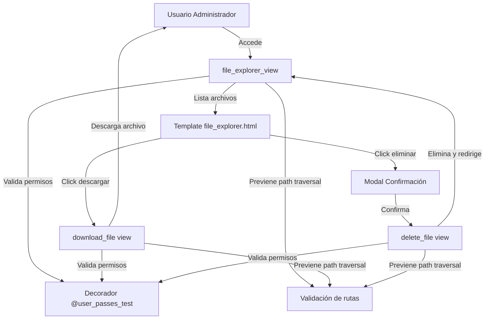

# Plan de Arquitectura: Explorador de Archivos Web

## 📋 Resumen del Proyecto

Diseñar e implementar un explorador de archivos web para navegar por la carpeta `/media/` del proyecto Django, permitiendo a los administradores visualizar, descargar y eliminar archivos de forma segura.

## 🎯 Requerimientos Funcionales

### Permisos de Acceso
- **Acceso restringido**: Solo usuarios con `is_superuser=True`
- **Decorador**: `@user_passes_test(lambda u: u.is_superuser)`
- **Redirección**: Usuarios no autorizados → página de login

### Funcionalidades Core
1. **Navegación de directorios**: Explorar carpetas y subcarpetas dentro de `/media/`
2. **Visualización de archivos**: Listar archivos con información (nombre, tamaño, fecha)
3. **Descarga de archivos**: Descargar archivos individuales
4. **Eliminación de archivos**: Eliminar archivos con confirmación previa

### Seguridad
- Prevenir Path Traversal attacks (acceso a archivos fuera de `/media/`)
- Validación de rutas con `os.path.realpath()` y `os.path.commonpath()`
- CSRF protection en formularios de eliminación
- Modal de confirmación antes de eliminar archivos

## 🏗️ Arquitectura del Sistema



## 📁 Estructura de Archivos

### 1. Backend: `autenticacion/views_file_explorer.py`

```python
# Funciones principales:
- get_safe_path(requested_path)  # Validación de rutas seguras
- file_explorer_view(request, subpath='')  # Vista principal de listado
- download_file(request, file_path)  # Vista de descarga
- delete_file(request, file_path)  # Vista de eliminación
```

**Características clave:**
- Decorador `@user_passes_test(lambda u: u.is_superuser)` en todas las vistas
- Validación estricta de rutas para prevenir ataques
- Manejo de errores con mensajes claros
- Response con `FileResponse` para descargas eficientes
- CSRF protection en POST requests

### 2. Frontend: `autenticacion/templates/file_explorer.html`

```html
Componentes principales:
- Breadcrumb navigation (ruta actual)
- Tabla de archivos y carpetas
- Iconos por tipo de archivo
- Botones de acción (descargar, eliminar)
- Modal de confirmación para eliminar
- Mensajes de Django (success, error)
```

**Interfaz de usuario:**
- Diseño responsive con Bootstrap 5
- Iconos FontAwesome para tipos de archivo
- Navegación intuitiva tipo breadcrumb
- Indicadores visuales de carpetas vs archivos

### 3. Estilos: `autenticacion/static/css/file_explorer.css`

```css
Componentes estilizados:
- Contenedor principal del explorador
- Tabla de archivos responsive
- Iconos de tipos de archivo con colores
- Breadcrumb navigation
- Botones de acción hover effects
- Modal de confirmación
```

**Paleta de colores:**
- Carpetas: Azul (#007bff)
- Documentos PDF: Rojo (#dc3545)
- Imágenes: Verde (#28a745)
- Otros archivos: Gris (#6c757d)

### 4. URLs: `autenticacion/urls.py`

```python
urlpatterns = [
    # ... rutas existentes ...
    path('file-explorer/', file_explorer_view, name='file_explorer'),
    path('file-explorer/<path:subpath>/', file_explorer_view, name='file_explorer_subpath'),
    path('file-download/<path:file_path>/', download_file, name='file_download'),
    path('file-delete/<path:file_path>/', delete_file, name='file_delete'),
]
```

## 🔒 Consideraciones de Seguridad

### 1. Validación de Rutas (Path Traversal Prevention)

```python
def get_safe_path(requested_path):
    """
    Valida que la ruta solicitada esté dentro de MEDIA_ROOT
    y previene ataques de path traversal
    """
    base_path = os.path.realpath(settings.MEDIA_ROOT)
    full_path = os.path.realpath(os.path.join(base_path, requested_path))
    
    # Verificar que la ruta está dentro de MEDIA_ROOT
    if not full_path.startswith(base_path):
        raise PermissionDenied("Acceso denegado a esta ruta")
    
    return full_path
```

### 2. Control de Acceso

- Decorador `@user_passes_test(lambda u: u.is_superuser)` en todas las vistas
- Redirección automática a login si no es superuser
- No exponer rutas sensibles en URLs

### 3. CSRF Protection

- Token CSRF en formularios de eliminación
- Validación de método POST para operaciones destructivas

### 4. Manejo de Errores

- Excepciones capturadas con mensajes claros
- Logging de operaciones críticas (eliminaciones)
- Validación de existencia de archivos antes de operar

## 📊 Flujo de Datos

### Navegación de Directorios

1. Usuario accede a `/autenticacion/file-explorer/`
2. Sistema valida que sea superuser
3. Sistema lista contenido de `/media/`
4. Template renderiza tabla con archivos y carpetas
5. Usuario hace click en carpeta
6. Sistema navega a `/autenticacion/file-explorer/nombre_carpeta/`
7. Proceso se repite para subcarpetas

### Descarga de Archivos

1. Usuario hace click en botón "Descargar"
2. Request GET a `/autenticacion/file-download/ruta/archivo.pdf`
3. Sistema valida ruta con `get_safe_path()`
4. Sistema verifica existencia del archivo
5. Sistema retorna `FileResponse` con archivo
6. Navegador descarga el archivo

### Eliminación de Archivos

1. Usuario hace click en botón "Eliminar"
2. Modal de confirmación aparece
3. Usuario confirma eliminación
4. Request POST a `/autenticacion/file-delete/ruta/archivo.pdf`
5. Sistema valida CSRF token
6. Sistema valida ruta con `get_safe_path()`
7. Sistema elimina archivo con `os.remove()`
8. Mensaje de éxito y redirección a listado

## 🎨 Interfaz de Usuario

### Layout Principal

```
┌─────────────────────────────────────────────────────┐
│  Explorador de Archivos                              │
│  Home > email_attachments                            │
├─────────────────────────────────────────────────────┤
│  📁 Nombre          │ Tamaño  │ Fecha       │ Acciones│
├─────────────────────┼─────────┼───────────┼─────────┤
│  📁 subcarpeta      │    -    │ 10/11/2025│  [Ver]  │
│  📄 documento.pdf   │ 1.2 MB  │ 09/11/2025│ [⬇][🗑] │
│  🖼️ imagen.jpg      │ 340 KB  │ 08/11/2025│ [⬇][🗑] │
└─────────────────────────────────────────────────────┘
```

### Breadcrumb Navigation

```html
<nav aria-label="breadcrumb">
  <ol class="breadcrumb">
    <li class="breadcrumb-item"><a href="/autenticacion/file-explorer/">Media</a></li>
    <li class="breadcrumb-item"><a href="/autenticacion/file-explorer/carpeta1/">carpeta1</a></li>
    <li class="breadcrumb-item active">subcarpeta</li>
  </ol>
</nav>
```

## 🧪 Casos de Prueba

### Pruebas de Seguridad

1. **Test Path Traversal**: Intentar acceder a `../../settings.py` → Debe denegar acceso
2. **Test Acceso No Autorizado**: Usuario staff intenta acceder → Redirección a login
3. **Test CSRF**: POST sin token → Error 403

### Pruebas Funcionales

1. **Test Navegación**: Navegar a subcarpetas y volver → Debe funcionar correctamente
2. **Test Descarga**: Descargar archivo PDF → Debe descargar correctamente
3. **Test Eliminación**: Eliminar archivo con confirmación → Debe eliminar y mostrar mensaje
4. **Test Archivo No Existe**: Intentar descargar archivo inexistente → Debe mostrar error

### Pruebas de UI

1. **Test Responsive**: Visualizar en móvil y desktop → Debe adaptarse correctamente
2. **Test Iconos**: Verificar iconos por tipo de archivo → Deben mostrarse correctamente
3. **Test Modal**: Abrir y cerrar modal de confirmación → Debe funcionar suavemente

## 📝 Documentación Adicional

### Tipos de Archivo Soportados

| Extensión | Icono | Color | Descripción |
|-----------|-------|-------|-------------|
| `.pdf` | 📄 | Rojo | Documentos PDF |
| `.jpg`, `.png`, `.gif` | 🖼️ | Verde | Imágenes |
| `.doc`, `.docx` | 📝 | Azul | Documentos Word |
| `.xls`, `.xlsx` | 📊 | Verde oscuro | Hojas de cálculo |
| Otros | 📄 | Gris | Archivos genéricos |
| Carpetas | 📁 | Azul | Directorios |

### Configuración en settings.py

```python
# Ya configurado:
MEDIA_URL = '/media/'
MEDIA_ROOT = '/media'  # En producción
MEDIA_ROOT = os.path.join(BASE_DIR, 'media')  # En desarrollo
```

### Integración con el Menú

Añadir en [`base.html`](autenticacion/templates/base.html) dentro de la categoría "Administración":

```html
<li class="nav-item active">
    <a href="" class="nav-link">
        <div class="nav-icon admin-bg"><i class="fas fa-folder-open"></i></div>
        <span class="nav-text">Explorador de Archivos</span>
    </a>
</li>
```

## ✅ Checklist de Implementación

- [ ] Implementar [`views_file_explorer.py`](autenticacion/views_file_explorer.py) con funciones de seguridad
- [ ] Crear template [`file_explorer.html`](autenticacion/templates/file_explorer.html) con breadcrumb y modal
- [ ] Diseñar estilos en [`file_explorer.css`](autenticacion/static/css/file_explorer.css)
- [ ] Configurar rutas en [`autenticacion/urls.py`](autenticacion/urls.py)
- [ ] Añadir enlace en menú de [`base.html`](autenticacion/templates/base.html)
- [ ] Probar funcionalidades de navegación
- [ ] Probar descarga de archivos
- [ ] Probar eliminación con confirmación
- [ ] Validar seguridad (path traversal, permisos)
- [ ] Probar responsive design

## 🚀 Próximos Pasos

1. **Revisión del plan** con el usuario
2. **Cambio a modo Code** para implementación
3. **Desarrollo iterativo** de cada componente
4. **Pruebas de seguridad y funcionalidad**
5. **Documentación final** y entrega

---

**Fecha de creación**: 2025-11-09  
**Modo**: Architect  
**Estado**: Completo y listo para revisión